PAV - P4: reconocimiento y verificación del locutor
===================================================

Obtenga su copia del repositorio de la práctica accediendo a [Práctica 4](https://github.com/albino-pav/P4)
y pulsando sobre el botón `Fork` situado en la esquina superior derecha. A continuación, siga las
instrucciones de la [Práctica 2](https://github.com/albino-pav/P2) para crear una rama con el apellido de
los integrantes del grupo de prácticas, dar de alta al resto de integrantes como colaboradores del proyecto
y crear la copias locales del repositorio.

También debe descomprimir, en el directorio `PAV/P4`, el fichero [db_8mu.tgz](https://atenea.upc.edu/mod/resource/view.php?id=3654387?forcedownload=1)
con la base de datos oral que se utilizará en la parte experimental de la práctica.

Como entrega deberá realizar un *pull request* con el contenido de su copia del repositorio. Recuerde
que los ficheros entregados deberán estar en condiciones de ser ejecutados con sólo ejecutar:

~~~~~~~~~~~~~~~~~~~~~~~~~~~~~~~~~~~~~~~~~~~~~~~~~~~~~.sh
  make release
  run_spkid mfcc train test classerr verify verifyerr
~~~~~~~~~~~~~~~~~~~~~~~~~~~~~~~~~~~~~~~~~~~~~~~~~~~~~

Recuerde que, además de los trabajos indicados en esta parte básica, también deberá realizar un proyecto
de ampliación, del cual deberá subir una memoria explicativa a Atenea y los ficheros correspondientes al
repositorio de la práctica.

A modo de memoria de la parte básica, complete, en este mismo documento y usando el formato *markdown*, los
ejercicios indicados.

## Ejercicios.

### SPTK, Sox y los scripts de extracción de características.

- Analice el script `wav2lp.sh` y explique la misión de los distintos comandos involucrados en el *pipeline*
  principal (`sox`, `$X2X`, `$FRAME`, `$WINDOW` y `$LPC`). Explique el significado de cada una de las 
  opciones empleadas y de sus valores.

En el script wav2lp.sh se eliminan los ficheros temporales antes de hacer la parametrización del señal .wav.
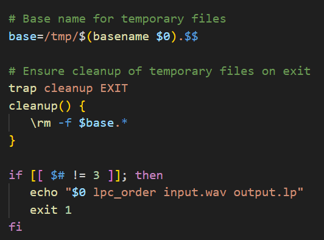

Para utilizar este script necesitamos introducir el numero de coeficientes LPC, los ficheros .wav de entrada, y el fichero de salida. Si no se introducen estos parametros se muestra el mensaje. 

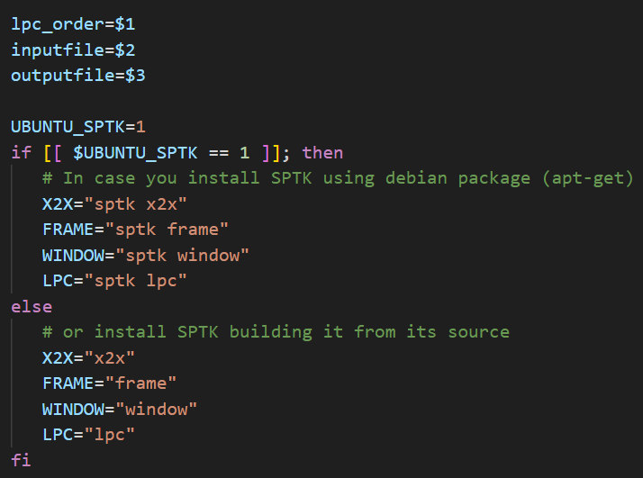

Guardamos los parametros especificados en $1 , $2 , $3. El $0 no lo usamos porque es el nombre del script. En función de si nuestra maquina es ubuntu o apple se modifican los comandos para utilizar sptk. Esto se controla mediante la variable $UBUNTU_SPTK. 

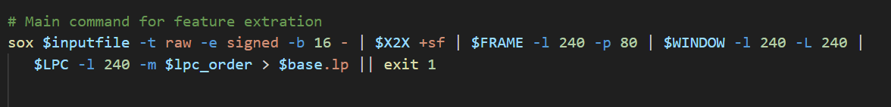

Pasamos a la función principal del scrpit, utilizando un pipeline principal controlamos el formato del señal que va a recibir SPTK en cada "programa" y hemos de harcelo respetando las instrucciones de SPTK.

En la primera pipeline SOX nos permite convertir los bytes del fichero wav a enteros de 16 bits con signo. Esto es necesario para trabajar con SPTK porque no podemos utilizar la codificación del fichero wav ya que esta hecha con la ley mu, y SPTK solo trabaja con señales tipo float.

En el siguiente paso utilizamos X2X para convertir los datos a enteros con signo de 2 bytes (+s) y luego a float de 4 bytes (+f).

Con el programa FRAME hacemos que la extracción de los datos se realize en ventanas de 240 muestras ( corresponde con un vetana de 30 ms y una frecuencia de muestro de 8000 Hz) y el desplazamiento entre ventanas de 80 muestras ( 10 ms).

Con el programa WINDOW enventamos el señal. Como ya lo hemos configurado antes, son 240 muestas que entran y 240 muestras que salen.

En el utlimo paso usamos el programa LPC para determinar el numero de muestras y el numero de coeficentes lpc.

- Explique el procedimiento seguido para obtener un fichero de formato *fmatrix* a partir de los ficheros de
  salida de SPTK (líneas 45 a 51 del script `wav2lp.sh`).

  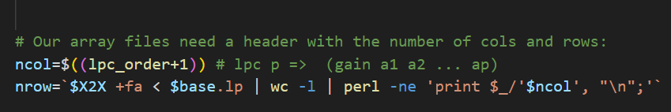

  Para definir el numero de columnas usamos el orden de los coeficientes LPC, pero sumamos uno, ya que la primera columna corresponde a la ganancia.

  Para saber el numero de filas, primero pasamos el contenido de los ficheros temporales a un conjunto de 4 bytes float concatedanos  a un formato ASCII (+fa). De esta forma obtenemos un archivo con un valor ASCII en cada linia  y podemos extraerlas si usamos wc -1 . Con este metodo sabemos cual es el numero de filas. 

  * ¿Por qué es más conveniente el formato *fmatrix* que el SPTK?

Este formato es conveniente ya que hemos pasado de un fichero .wav codificado con la ley mu en conjutos de 8 bits a fmatrix que nos permite obtener una señal ordenada y carecterizada por tramas. Cada columna correspode a los coeficientes lpc y las filas estan contenidas por cada trama. Este formato nos permite trabjar de forma mas sencilla y comoda. Así podemos seleccionar y visualizar columnas en especifico mediante los progrmas "fmatrix_show" y "fmatrix_cut"

- Escriba el *pipeline* principal usado para calcular los coeficientes cepstrales de predicción lineal
  (LPCC) en su fichero <code>scripts/wav2lpcc.sh</code>:

Main command for feature extration
sox $inputfile -t raw -e signed -b 16 - | $X2X +sf | $FRAME -l 240 -p 80 | $WINDOW -l 240 -L 240 |
	$LPC -l 240 -m $lpc_order | $LPCC -m $lpc_order -M $lpcc_order > $base.lpcc || exit 1

- Escriba el *pipeline* principal usado para calcular los coeficientes cepstrales en escala Mel (MFCC) en su fichero <code>scripts/wav2mfcc.sh</code>:

Main command for feature extration
sox $inputfile -t raw -e signed -b 16 - | $X2X +sf | $FRAME -l 240 -p 80 | $WINDOW -l 240 -L 240 |
	$MFCC -l 240 -m $mfcc_order -n $mel_bank_order > $base.mfcc || exit 1

### Extracción de características.

- Inserte una imagen mostrando la dependencia entre los coeficientes 2 y 3 de las tres parametrizaciones
  para todas las señales de un locutor.
  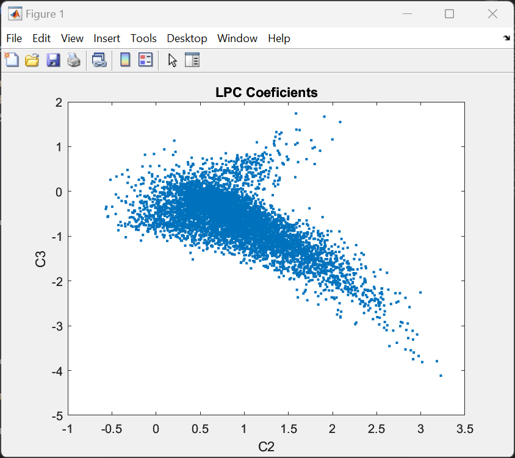
  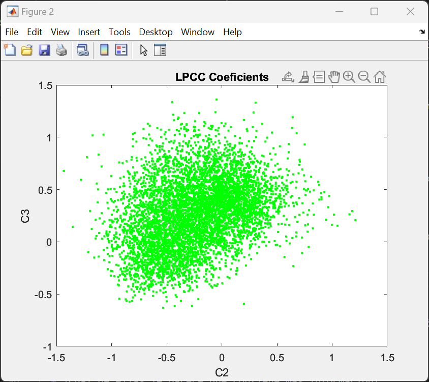
  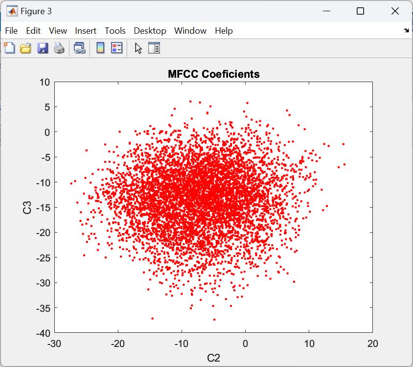
  
  + Indique **todas** las órdenes necesarias para obtener las gráficas a partir de las señales 
    parametrizadas.
    Convertimos los archivos fmatrix de lpc, lpcc y mfcc en archivos txt solo con las columnas de los coeficientes 2 y 3 con fmatrix show.
    

    En Matlab hacemos la visualización de las graficas

    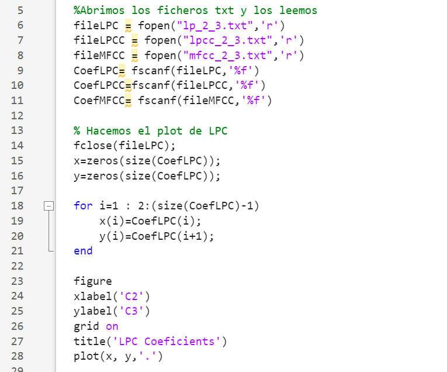
    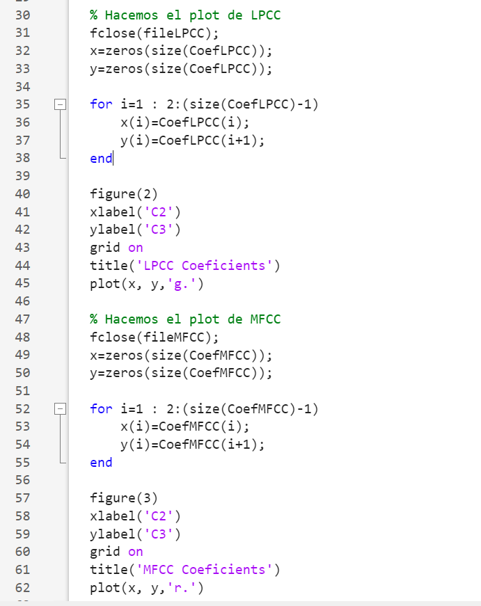
    
    
  + ¿Cuál de ellas le parece que contiene más información?

  Si observamos las graficas de los coeficientes, con LPC la distribucion de los datos es mas concentrada y se forma una elipse diagonal, por lo que los coeficientes 2 y 3 estan correlados. En cambio los LPCC Y MFCC tiene una distribucion dispersa y con forma circular por lo que estan incorrelados los coeficientes. Por la tanto en MFCC y LPCC ganamos mas al usar varios coeficentes, porque nos aportaran mas información si trabajamos con ellos. 

- Usando el programa <code>pearson</code>, obtenga los coeficientes de correlación normalizada entre los
  parámetros 2 y 3 para un locutor, y rellene la tabla siguiente con los valores obtenidos.

  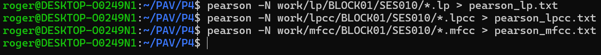

  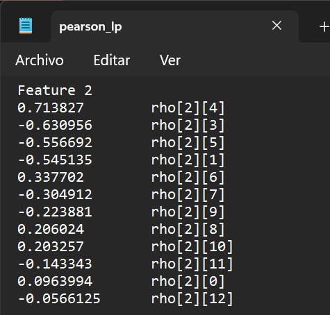

  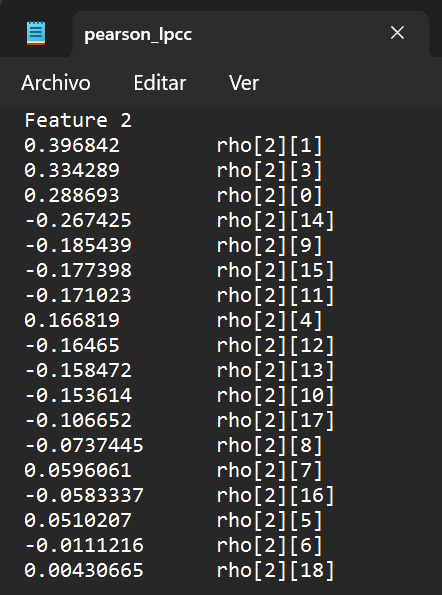

  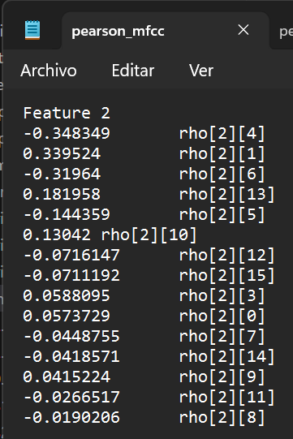

 
  |                        | LP   | LPCC | MFCC |
  |------------------------|:----:|:----:|:----:|
  | &rho;x[2,3] |-0.630|0.3342|0.05881|
   
  + Compare los resultados de <code>pearson</code> con los obtenidos gráficamente.

  Vemos que los coeficientes pearson de MFCC y LPCC son mas cercanos a 0. Esto significa que son menos correlados, mientras que LP tiene un valor cercano a -1 con lo que sus coeficenetes si estan correlados.  
  
- Según la teoría, ¿qué parámetros considera adecuados para el cálculo de los coeficientes LPCC y MFCC?
En el caso de los LPCC se trabaja con alrededor de 13 coeficientes. Para los MFCC se utilizan entre 24 y 40 filtros, con 13 coeficientes. 
### Entrenamiento y visualización de los GMM.

Complete el código necesario para entrenar modelos GMM.

- Inserte una gráfica que muestre la función de densidad de probabilidad modelada por el GMM de un locutor
  para sus dos primeros coeficientes de MFCC.

- Inserte una gráfica que permita comparar los modelos y poblaciones de dos locutores distintos (la gŕafica
  de la página 20 del enunciado puede servirle de referencia del resultado deseado). Analice la capacidad
  del modelado GMM para diferenciar las señales de uno y otro.

### Reconocimiento del locutor.

Complete el código necesario para realizar reconociminto del locutor y optimice sus parámetros.

- Inserte una tabla con la tasa de error obtenida en el reconocimiento de los locutores de la base de datos
  SPEECON usando su mejor sistema de reconocimiento para los parámetros LP, LPCC y MFCC.

### Verificación del locutor.

Complete el código necesario para realizar verificación del locutor y optimice sus parámetros.

- Inserte una tabla con el *score* obtenido con su mejor sistema de verificación del locutor en la tarea
  de verificación de SPEECON. La tabla debe incluir el umbral óptimo, el número de falsas alarmas y de
  pérdidas, y el score obtenido usando la parametrización que mejor resultado le hubiera dado en la tarea
  de reconocimiento.
 
### Test final

- Adjunte, en el repositorio de la práctica, los ficheros `class_test.log` y `verif_test.log` 
  correspondientes a la evaluación *ciega* final.

### Trabajo de ampliación.

- Recuerde enviar a Atenea un fichero en formato zip o tgz con la memoria (en formato PDF) con el trabajo 
  realizado como ampliación, así como los ficheros `class_ampl.log` y/o `verif_ampl.log`, obtenidos como 
  resultado del mismo.
